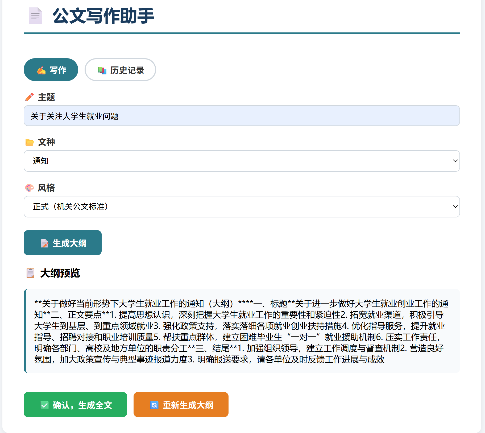
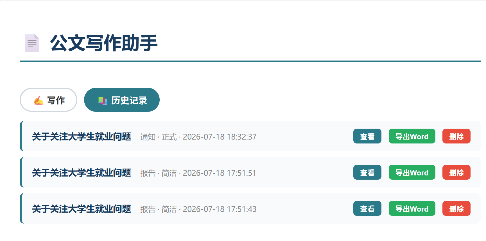
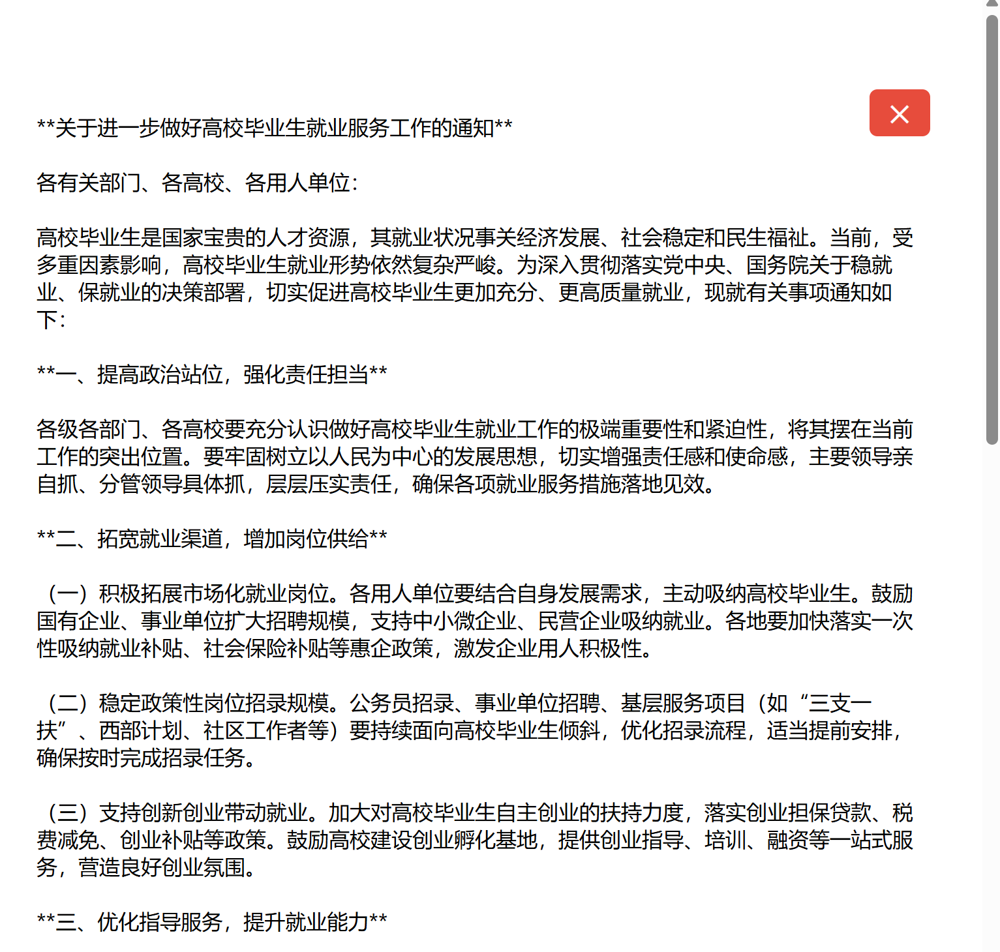

# ?? 公文写作助手

一个基于 AI 的公文写作工具，输入主题、文种、风格，自动生成规范公文。

---

## ?? 技术栈

- Python 3.13
- Flask（Web 框架）
- DeepSeek API（兼容 OpenAI 接口）
- python-dotenv（环境变量管理）

---

## ? 功能特点

- 支持 **通知、报告、讲话稿、请示、批复** 5 种文种
- 支持 **正式、亲民、简洁** 3 种写作风格
- AI 自动生成结构完整的公文（标题、正文、落款）

---

## ?? 效果预览




---

## ?? 本地运行

```bash
# 1. 克隆项目
git clone https://github.com/2091son/gov-doc-assistant.git
cd gov-doc-assistant

# 2. 安装依赖
pip install -r requirements.txt

# 3. 创建 .env 文件，填入你的 API Key
OPENAI_API_KEY=你的Key
OPENAI_BASE_URL=https://api.deepseek.com/v1

# 4. 启动服务
python app.py
```

---

## ?? 项目结构

```
gov-doc-assistant/
├── app.py              # Flask 主程序
├── requirements.txt    # 依赖清单
├── .env                # 环境变量（需自行创建）
├── .gitignore          # Git 忽略文件
├── templates/
│   └── index.html      # 前端页面
└── README.md           # 项目说明
```

---

## ?? 使用场景

- 公务员备考练习公文写作
- 机关单位工作人员快速生成公文草稿
- 学习 AI Prompt 工程和 API 调用

---

## ?? License

MIT
